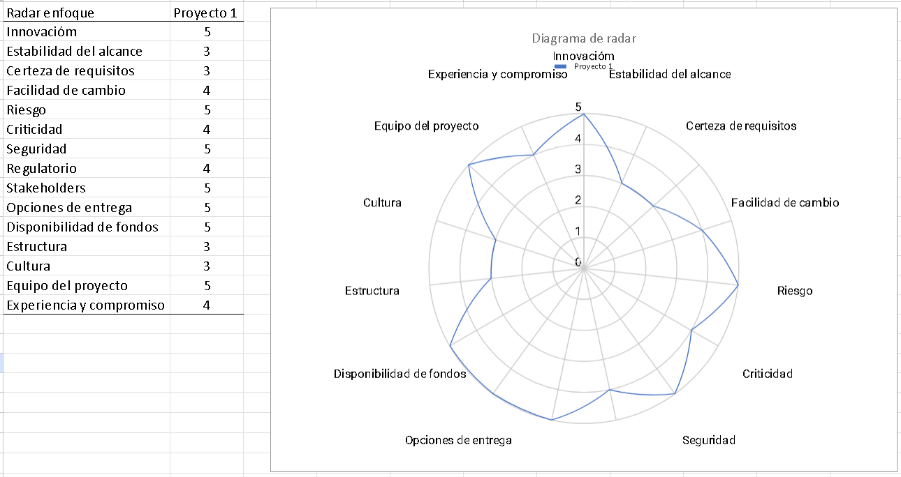

# 01. Selección del enfoque del proyecto

## 1. Metadatos del proyecto

| Campo | Información |
|---|---|
| **Nombre del proyecto** | EcoLogística Huancayo |
| **Tipo de proyecto** | Proyecto Final de Asignatura |
| **Enfoque seleccionado** | Híbrido |
| **Integrantes** | [Completar con nombres del equipo] |
| **Fecha** | 30/08/2026 |
| **Versión** | 1.0.0 |

---

## 2. Matriz de ponderación de variables

La siguiente matriz evalúa las principales características del proyecto EcoLogística Huancayo mediante una escala cuantitativa de 1 a 5.

### Escala de valoración

| Valor | Interpretación |
|---:|---|
| 1 | Muy bajo |
| 2 | Bajo |
| 3 | Medio |
| 4 | Alto |
| 5 | Muy alto |

| N.° | Variable | Valor (1-5) | Justificación |
|---:|---|---:|---|
| 1 | **Innovación** | **5** | El proyecto integra optimización de rutas, criterios ambientales, visualización geográfica y apoyo a la toma de decisiones mediante una solución tecnológica. |
| 2 | **Estabilidad del alcance** | **3** | El propósito y los componentes principales están definidos, pero algunos aspectos deberán adaptarse al contexto logístico de Huancayo durante el desarrollo. |
| 3 | **Certeza de requisitos** | **3** | Existe una base inicial de requisitos proporcionada por la consigna, aunque será necesario precisarlos y adaptarlos a las condiciones locales. |
| 4 | **Facilidad de cambio** | **4** | La solución puede desarrollarse por módulos e iteraciones, permitiendo modificar funcionalidades y reglas sin afectar necesariamente todo el sistema. |
| 5 | **Riesgo** | **5** | El proyecto presenta complejidad técnica por la optimización de rutas, integración geográfica, restricciones, rendimiento y adaptación de datos. |
| 6 | **Criticidad** | **4** | El sistema influye en la planificación logística y puede generar pérdidas operativas si funciona incorrectamente, aunque no corresponde a un sistema de criticidad vital. |
| 7 | **Seguridad** | **5** | Se manejarán datos de clientes, conductores, usuarios, pedidos y ubicaciones, por lo que la protección de la información es de alta importancia. |
| 8 | **Regulatorio** | **4** | El proyecto deberá considerar legislación peruana relacionada con tránsito, protección de datos y operación vehicular. |
| 9 | **Stakeholders** | **5** | Intervienen diversos interesados, entre ellos responsables administrativos, conductores, clientes y equipo de desarrollo. |
| 10 | **Opciones de entrega** | **5** | El sistema puede entregarse progresivamente mediante módulos e iteraciones: gestión, optimización, mapas, indicadores y funcionalidades complementarias. |
| 11 | **Disponibilidad de fondos** | **5** | Para el desarrollo académico se puede priorizar el uso de tecnologías de código abierto y recursos existentes, permitiendo ejecutar el MVP sin requerir una infraestructura empresarial completa. |
| 12 | **Estructura** | **3** | Los componentes principales del sistema están identificados, pero la estructura organizacional y operativa del caso de estudio aún debe formalizarse. |
| 13 | **Cultura** | **3** | La incorporación de una solución digital para la gestión logística requiere considerar la adaptación y aceptación de los usuarios operativos. |
| 14 | **Equipo del proyecto** | **5** | El proyecto puede dividirse claramente entre análisis, diseño, desarrollo, base de datos, optimización, pruebas y documentación. |
| 15 | **Experiencia y compromiso** | **4** | El proyecto requiere diferentes conocimientos técnicos, pero puede abordarse mediante planificación, distribución de responsabilidades y trabajo iterativo. |

---

## 3. Diagrama de radar del enfoque

El perfil del proyecto presenta una combinación de alta innovación, riesgo, seguridad, participación de interesados y posibilidad de entregas progresivas, mientras que la estabilidad y certeza inicial de los requisitos son intermedias.

> **Nota:** El archivo `radar-enfoque-ecologistica-huancayo.png` representa gráficamente los valores definidos en la matriz anterior.

---

## 4. Análisis del perfil del proyecto

El análisis de la matriz evidencia que EcoLogística Huancayo presenta características que requieren un equilibrio entre planificación y adaptación.

Los niveles altos de **innovación, riesgo, seguridad, stakeholders y opciones de entrega** indican que el proyecto necesita una gestión estructurada, seguimiento continuo y capacidad de respuesta ante cambios.

Por otro lado, la **estabilidad y certeza de los requisitos presentan valores medios**, debido a que la solución debe ser adaptada al contexto geográfico, operativo y tecnológico de Huancayo.

Además, el desarrollo del sistema involucra componentes que pueden evolucionar durante el proyecto, especialmente el algoritmo de optimización, la visualización de rutas, los criterios de sostenibilidad y la experiencia de los usuarios.

---

## 5. Decisión del enfoque de gestión

### Enfoque seleccionado: HÍBRIDO

Se selecciona un **enfoque híbrido** para la gestión de EcoLogística Huancayo, debido a que el proyecto combina características que requieren planificación inicial y, al mismo tiempo, componentes que necesitan desarrollo iterativo y capacidad de adaptación.

El componente predictivo se aplicará principalmente a:

- definición del alcance general;
- documentación de requisitos;
- arquitectura del sistema;
- diseño de la base de datos;
- definición de estándares de calidad;
- planificación de entregables;
- cumplimiento de restricciones y criterios establecidos por la asignatura.

El componente ágil se aplicará principalmente a:

- desarrollo incremental del software;
- construcción progresiva de los módulos;
- evolución de la interfaz;
- validación del algoritmo de optimización;
- pruebas frecuentes;
- incorporación de mejoras a partir de los resultados obtenidos.

Este enfoque permite mantener el control sobre los objetivos, restricciones, calidad y documentación del proyecto, mientras se conserva la flexibilidad necesaria para adaptar la solución conforme se obtenga mayor conocimiento del problema.

---

## 6. Justificación técnica

El enfoque híbrido resulta adecuado para EcoLogística Huancayo porque el proyecto posee un conjunto inicial de objetivos y requisitos establecidos, pero también contiene elementos con un elevado grado de incertidumbre técnica.

La construcción de un sistema de optimización de rutas requiere experimentar con diferentes parámetros, evaluar soluciones generadas por la metaheurística y realizar ajustes durante el desarrollo. De manera similar, la interfaz, los mapas, los indicadores y otros componentes pueden requerir modificaciones después de las pruebas con los usuarios.

Por ello, un enfoque exclusivamente predictivo podría limitar la capacidad de adaptación ante descubrimientos realizados durante el desarrollo. En sentido contrario, un enfoque completamente ágil podría dificultar el control de los entregables formales, restricciones, documentación y criterios de calidad exigidos por la asignatura.

El enfoque híbrido permite combinar planificación, gobernanza y control con ciclos iterativos de desarrollo y aprendizaje.

Esta decisión es coherente con la naturaleza del proyecto y con la necesidad de generar valor progresivamente, mantener una visión clara del producto y adaptar la solución cuando exista nueva información.

---

## 7. Alineación con los principios de gestión del proyecto

La selección del enfoque híbrido se relaciona con los principios de dirección de proyectos al priorizar:

1. **Generación de valor**, orientando el desarrollo hacia la solución del problema logístico y la mejora de la eficiencia de las rutas.

2. **Adaptabilidad**, permitiendo ajustar funcionalidades, parámetros y decisiones técnicas conforme avance el proyecto.

3. **Participación de los interesados**, incorporando retroalimentación de los usuarios y responsables involucrados.

4. **Calidad**, integrando pruebas y controles durante el desarrollo en lugar de concentrarlos únicamente al final.

5. **Gestión de riesgos**, identificando anticipadamente los riesgos técnicos, operativos y organizacionales.

6. **Desarrollo progresivo**, permitiendo entregar funcionalidades en diferentes iteraciones y verificar los resultados de manera continua.

---

## 8. Conclusión

EcoLogística Huancayo adoptará un **enfoque híbrido de gestión de proyectos**, combinando planificación estructurada con desarrollo iterativo.

Esta elección responde a la necesidad de mantener control sobre el alcance, los requisitos, la documentación, los riesgos y la calidad, mientras se dispone de flexibilidad para adaptar el algoritmo de optimización, la interfaz, los mapas y las funcionalidades del sistema.

Por tanto, el enfoque híbrido es el más adecuado para equilibrar **control, adaptación, aprendizaje y generación progresiva de valor** durante el desarrollo del proyecto.

---

## 9. Control de cambios

La versión inicial del presente documento corresponde a **V_1_0_0**.