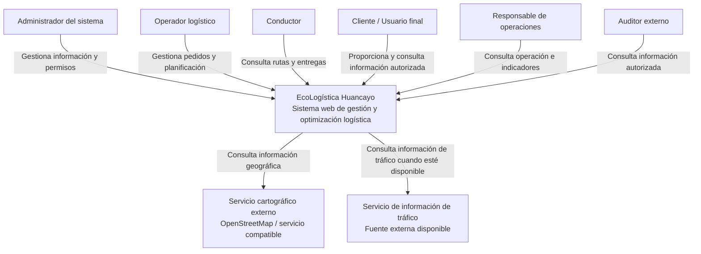
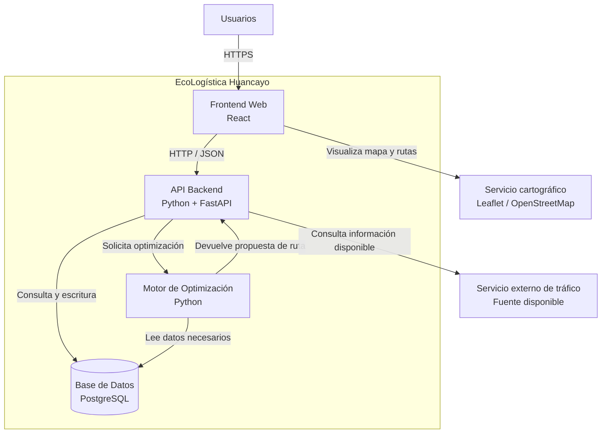
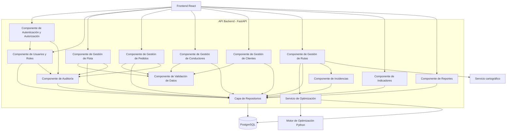
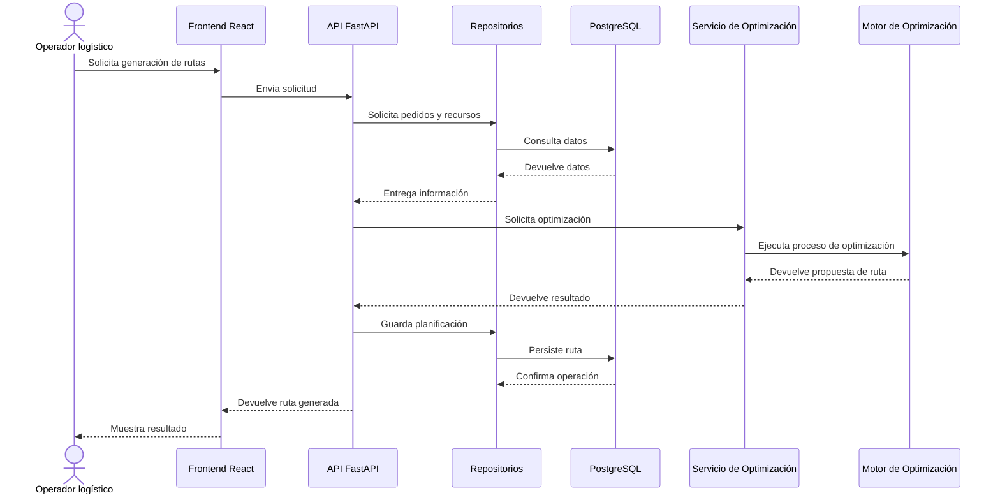

# 12. Modelo C4 V_1_0_0.md

## 1. Información general

| Campo | Información |
|---|---|
| **Nombre del proyecto** | EcoLogística Huancayo |
| **Tipo de documento** | Arquitectura de Software - Modelo C4 |
| **Enfoque de gestión** | Híbrido |
| **Versión** | 1.0.0 |
| **Fecha** | 01/09/2026 |

---

# 2. Propósito

El presente documento describe la arquitectura de software de EcoLogística Huancayo utilizando el enfoque del Modelo C4.

La arquitectura se organiza en tres niveles:

1. **Nivel 1 - Contexto del sistema:** identifica el sistema, sus usuarios y los sistemas o servicios externos con los que interactúa.
2. **Nivel 2 - Contenedores:** identifica las principales unidades ejecutables y de almacenamiento que componen la solución.
3. **Nivel 3 - Componentes:** describe los componentes internos principales del backend y sus responsabilidades.

La arquitectura se deriva de los requisitos funcionales, requisitos no funcionales, reglas de negocio, perfiles de usuario y stack tecnológico definidos en los documentos anteriores.

---

# 3. Principios arquitectónicos

La arquitectura de EcoLogística Huancayo seguirá los siguientes principios:

- Separación de responsabilidades.
- Bajo acoplamiento entre capas.
- Alta cohesión de los componentes.
- Seguridad mediante control de acceso y mínimo privilegio.
- Trazabilidad de operaciones relevantes.
- Escalabilidad de los componentes con mayor carga.
- Facilidad de mantenimiento.
- Uso responsable de recursos computacionales.
- Desarrollo incremental compatible con el enfoque híbrido del proyecto.

---

# 4. Nivel 1 - Diagrama de contexto

## 4.1 Descripción

El diagrama de contexto representa a EcoLogística Huancayo como un único sistema y muestra sus principales actores y sistemas externos relacionados.

Los usuarios interactúan con la plataforma según el rol y permisos definidos. El sistema puede utilizar servicios externos para información cartográfica y otros recursos necesarios para la planificación.

## 4.2 Diagrama

## 4.3 Actores principales

| Actor | Interacción con el sistema |
|---|---|
| **Administrador** | Gestiona usuarios, permisos, vehículos, conductores y parámetros autorizados. |
| **Operador logístico** | Gestiona pedidos, recursos, generación y reoptimización de rutas. |
| **Conductor** | Consulta rutas, entregas y alertas relacionadas con su operación. |
| **Cliente / Usuario final** | Proporciona información de pedidos y consulta información propia autorizada. |
| **Responsable de operaciones** | Consulta indicadores, rutas y resultados de la operación. |
| **Auditor externo** | Consulta información y evidencias autorizadas. |

---

# 5. Nivel 2 - Diagrama de contenedores

## 5.1 Descripción

El nivel de contenedores descompone EcoLogística Huancayo en sus principales unidades tecnológicas y de ejecución.

La arquitectura utiliza como base el stack seleccionado en el documento 10:

- React para frontend.
- Python + FastAPI para backend.
- Python para el motor de optimización.
- PostgreSQL para persistencia.
- Leaflet / OpenStreetMap para visualización cartográfica.

## 5.2 Diagrama

## 5.3 Contenedores

| Contenedor | Tecnología | Responsabilidad |
|---|---|---|
| **Frontend Web** | React | Presentar la interfaz y permitir la interacción de los usuarios. |
| **API Backend** | Python + FastAPI | Gestionar solicitudes, reglas de aplicación, permisos y comunicación entre componentes. |
| **Motor de Optimización** | Python | Procesar el problema de ruteo y generar propuestas de rutas. |
| **Base de Datos** | PostgreSQL | Persistir usuarios, roles, vehículos, conductores, clientes, pedidos, rutas, entregas e incidencias. |
| **Servicio cartográfico** | Leaflet / OpenStreetMap | Representar mapas, rutas y puntos geográficos en la interfaz. |
| **Servicio externo de tráfico** | Fuente externa disponible | Proporcionar información de tráfico cuando exista una integración disponible para el proyecto. |

---

# 6. Nivel 3 - Diagrama de componentes

## 6.1 Descripción

El nivel de componentes detalla los principales módulos internos del contenedor de API Backend.

La organización separa controladores, servicios, repositorios y componentes transversales de seguridad y validación.

## 6.2 Diagrama

---

# 7. Descripción de componentes

## 7.1 Autenticación y autorización

Responsable de validar la identidad del usuario y aplicar permisos asociados al rol.

Se relaciona directamente con las reglas:

- RN-012: Acceso según rol.
- RN-013: Acceso limitado a información personal.

## 7.2 Usuarios y roles

Gestiona las cuentas de usuario, roles y permisos administrativos correspondientes.

## 7.3 Gestión de flota

Gestiona los vehículos y sus características necesarias para la operación y optimización.

Incluye información como:

- placa;
- tipo;
- capacidad;
- consumo;
- factor de emisiones;
- estado operativo.

## 7.4 Gestión de pedidos

Administra el registro y consulta de pedidos, incluyendo ubicación, peso, volumen, prioridad, tipo de producto y ventanas de tiempo.

## 7.5 Gestión de conductores

Administra información de conductores, disponibilidad y datos necesarios para la asignación de rutas.

## 7.6 Gestión de clientes

Gestiona la información necesaria para identificar clientes, ubicaciones, preferencias y restricciones de entrega.

## 7.7 Gestión de rutas

Gestiona la creación, consulta y seguimiento de rutas.

También coordina la reoptimización cuando se registra un cambio operativo.

## 7.8 Servicio de optimización

Coordina la ejecución del motor de optimización y proporciona a la aplicación las propuestas de rutas generadas.

## 7.9 Motor de optimización

Es el componente encargado de procesar el problema de ruteo y evaluar soluciones según los criterios definidos por el proyecto.

Deberá considerar, de acuerdo con los requisitos establecidos:

- distancia;
- tiempo;
- consumo de combustible;
- emisiones de CO₂;
- penalizaciones por incumplimiento;
- restricciones operativas.

## 7.10 Indicadores

Procesa y presenta métricas relacionadas con:

- distancia;
- combustible;
- emisiones;
- cumplimiento de entregas;
- resultados comparativos.

## 7.11 Reportes

Prepara la información necesaria para la generación de reportes operativos y de sostenibilidad.

## 7.12 Incidencias

Registra eventos que puedan afectar pedidos o rutas, facilitando posteriormente la reoptimización y la trazabilidad.

## 7.13 Auditoría

Registra operaciones relevantes que requieren trazabilidad.

## 7.14 Validación de datos

Verifica que la información recibida cumpla las condiciones requeridas antes de pasar a los servicios de aplicación.

## 7.15 Repositorios

Centraliza el acceso a la persistencia de información para separar las operaciones de datos de la lógica de negocio.

---

# 8. Flujo arquitectónico principal: generación de ruta

---

# 9. Flujo arquitectónico de reoptimización

La reoptimización debe conservar la última planificación válida cuando no exista una nueva solución válida, de acuerdo con RN-011.

---

# 10. Relaciones arquitectónicas con los requisitos

| Requisito / necesidad | Componente arquitectónico |
|---|---|
| RF-001 Registrar vehículo | Gestión de Flota + Repositorios |
| RF-002 Consultar vehículos | Gestión de Flota + Repositorios |
| RF-003 Registrar pedido | Gestión de Pedidos + Validación |
| RF-004 Consultar pedidos | Gestión de Pedidos + Repositorios |
| RF-005 Registrar conductor | Gestión de Conductores + Validación |
| RF-006 Registrar cliente | Gestión de Clientes + Validación |
| RF-007 Generar ruta optimizada | Gestión de Rutas + Servicio de Optimización + Motor |
| RF-008 Visualizar ruta | Frontend React + Servicio cartográfico |
| RF-009 Indicadores | Componente de Indicadores |
| RF-010 Reoptimizar rutas | Gestión de Rutas + Servicio de Optimización + Incidencias |

---

# 11. Relaciones con requisitos no funcionales

| RNF | Decisión / componente relacionado |
|---|---|
| RNF-001 Rendimiento de generación | Motor de Optimización separado del API. |
| RNF-002 Rendimiento de reoptimización | Servicio de Optimización + Motor de Optimización. |
| RNF-003 Control de acceso | Autenticación y Autorización. |
| RNF-004 Seguridad OWASP | API, validación, autenticación y componentes de seguridad. |
| RNF-005 Disponibilidad | Separación de componentes y estrategia de despliegue escalable. |
| RNF-006 Usabilidad | Frontend React y vistas diferenciadas por rol. |
| RNF-007 Accesibilidad | Diseño de interfaz compatible con los criterios definidos. |
| RNF-008 Escalabilidad | Separación de frontend, API, motor y base de datos. |
| RNF-009 Compatibilidad | Frontend web y navegadores definidos como soportados. |
| RNF-010 Mantenibilidad | Separación por componentes y repositorios. |
| RNF-011 Eficiencia energética | Procesamiento limitado y consultas optimizadas. |
| RNF-012 Fiabilidad | Validación, persistencia e integridad de datos. |

---

# 12. Relaciones con reglas de negocio

| Regla | Componentes principales |
|---|---|
| RN-001 Unicidad de vehículos | Gestión de Flota + Base de Datos |
| RN-002 Capacidad máxima | Gestión de Rutas + Motor de Optimización |
| RN-003 Datos obligatorios | Gestión de Pedidos + Validación |
| RN-004 Ventana temporal | Gestión de Pedidos + Motor de Optimización |
| RN-005 Vehículos disponibles | Gestión de Flota + Gestión de Rutas |
| RN-006 Conductores disponibles | Gestión de Conductores + Gestión de Rutas |
| RN-007 Compatibilidad conductor-ruta | Gestión de Rutas + Motor |
| RN-008 Ventanas de entrega | Motor de Optimización |
| RN-009 Criterios de optimización | Servicio + Motor de Optimización |
| RN-010 Reoptimización | Gestión de Rutas + Incidencias + Motor |
| RN-011 Última planificación válida | Gestión de Rutas + Base de Datos |
| RN-012 Acceso según rol | Autenticación y Autorización |
| RN-013 Protección de datos | Autenticación + Autorización + Auditoría |
| RN-014 Integridad | Validación + Repositorios + PostgreSQL |
| RN-015 Trazabilidad | Auditoría |
| RN-016 Indicadores con datos suficientes | Indicadores + Repositorios |

---

# 13. Decisiones arquitectónicas

## 13.1 Separación frontend/backend

La interfaz y la lógica de aplicación se mantienen separadas para permitir evolución independiente y facilitar mantenimiento.

## 13.2 API como punto de integración

La API centraliza las operaciones del sistema y sirve como intermediaria entre la interfaz, la persistencia y los servicios especializados.

## 13.3 Motor de optimización independiente

El motor de optimización se mantiene separado de la interfaz y de la lógica de presentación para facilitar pruebas, experimentación y evolución de la metaheurística.

## 13.4 PostgreSQL como persistencia

El modelo relacional se utiliza para representar entidades y relaciones operativas con integridad referencial.

## 13.5 Arquitectura preparada para crecimiento

La separación en componentes permite ampliar los recursos de los servicios que presenten mayor carga sin modificar necesariamente las demás partes del sistema.

---

# 14. Consideraciones de seguridad

La arquitectura deberá contemplar:

- autenticación de usuarios;
- autorización por rol;
- principio de mínimo privilegio;
- validación de entradas;
- protección frente a vulnerabilidades web;
- control de sesiones;
- registro de operaciones relevantes;
- protección de información personal.

La implementación detallada de estos mecanismos se desarrollará durante las etapas de diseño e implementación.

---

# 15. Consideraciones de escalabilidad

La arquitectura permitirá evolucionar hacia un escenario de mayor carga mediante:

- separación de servicios;
- optimización de consultas;
- índices en PostgreSQL;
- procesamiento independiente del motor de optimización;
- escalamiento de componentes según la demanda.

La consigna establece como referencia de crecimiento hasta 1,000 pedidos diarios y 50 vehículos. 

---

# 16. Consideraciones de eficiencia energética

La arquitectura deberá aplicar criterios de Green Software mediante:

- reducción de consultas innecesarias;
- recuperación únicamente de datos requeridos;
- reducción de transferencias innecesarias;
- reutilización de resultados cuando sea conveniente;
- optimización del procesamiento;
- separación del motor de optimización para controlar su utilización computacional.

Estas medidas buscan reducir el uso innecesario de CPU, memoria, almacenamiento y transferencia de datos.

---

# 17. Consideraciones de integración externa

Los servicios externos de mapas y tráfico se tratarán como dependencias externas.

La arquitectura deberá evitar que la indisponibilidad temporal de un servicio externo provoque inconsistencias en la información ya registrada.

Cuando una fuente externa no esté disponible, deberán mantenerse mecanismos alternativos o datos previamente obtenidos cuando el alcance de la operación lo permita.

---

# 18. Validación de la arquitectura

La arquitectura deberá validarse mediante:

- revisión de diagramas C4;
- pruebas de integración;
- pruebas funcionales;
- pruebas de rendimiento;
- pruebas de seguridad;
- pruebas de consistencia de datos;
- revisión de trazabilidad entre requisitos y componentes.

---

# 19. Evolución futura

La arquitectura permitirá incorporar posteriormente componentes relacionados con:

- datos de tráfico en tiempo real;
- zonas de riesgo;
- compensación de carbono;
- costos de ciclo de vida;
- mantenimiento de vehículos;
- historial de reoptimización;
- notificaciones;
- monitoreo avanzado.

Estas extensiones no forman parte obligatoria del núcleo arquitectónico inicial si no están incluidas en el alcance del MVP.

---

# 20. Conclusión

El Modelo C4 de EcoLogística Huancayo establece una arquitectura en tres niveles que permite relacionar los usuarios, el sistema, los contenedores tecnológicos y los componentes internos necesarios para implementar la solución.

La arquitectura propuesta se basa en React para la interfaz, FastAPI para los servicios de aplicación, Python para el motor de optimización y PostgreSQL para persistencia, manteniendo una separación clara de responsabilidades.

La estructura facilita la trazabilidad con los requisitos funcionales, requisitos no funcionales y reglas de negocio definidos previamente, además de permitir la evolución progresiva del sistema bajo el enfoque híbrido del proyecto.

La versión inicial del presente documento corresponde a **V_1_0_0**.
