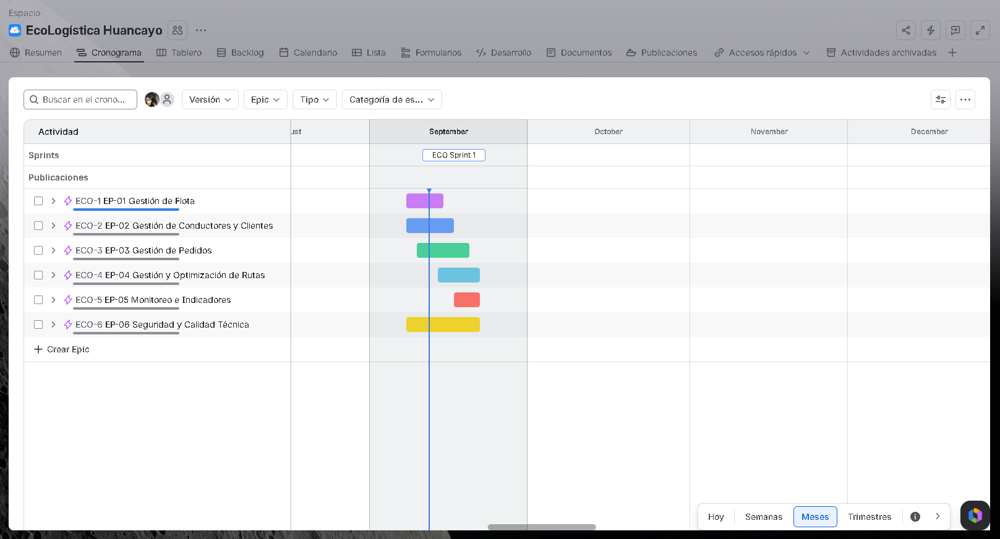
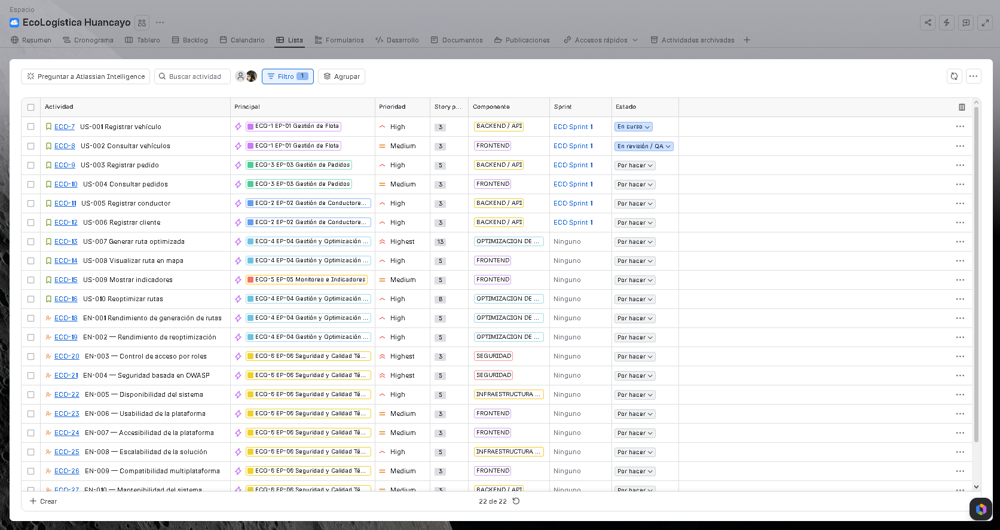
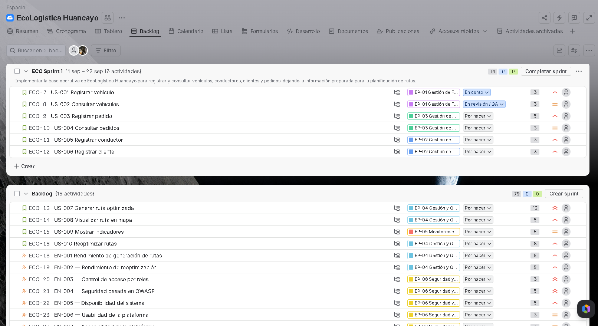
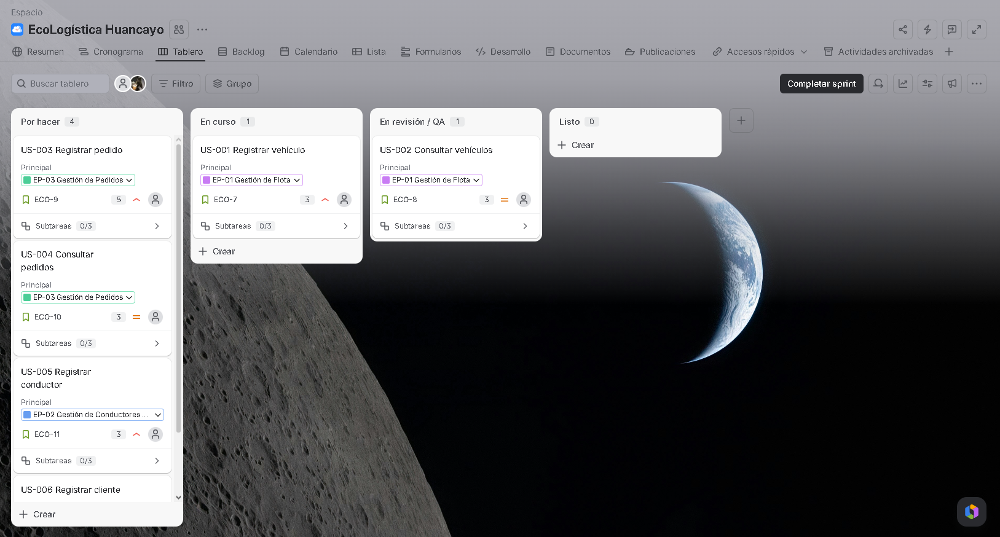
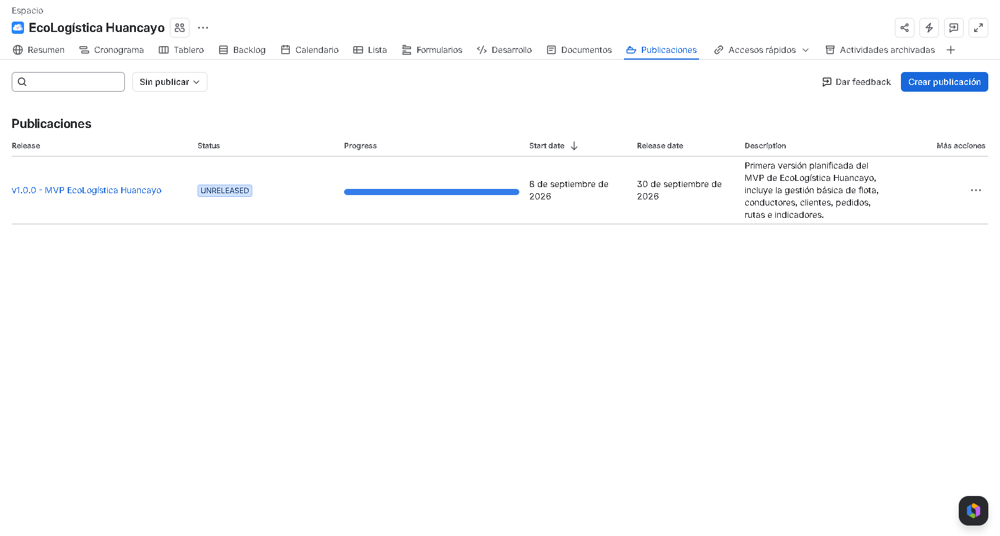

# 02 Artefactos Jira V_1_0_0

[← Volver al README Principal](../../README.md)

## 1. Información general

| Campo | Valor |
|---|---|
| Proyecto | EcoLogística Huancayo |
| Clave Jira | ECO |
| Tipo | Scrum, espacio gestionado por el equipo |
| Release | `v1.0.0 - MVP EcoLogística Huancayo` |
| Sprint | `ECO Sprint 1` |
| Sprint Goal | Implementar la base operativa de EcoLogística Huancayo para registrar y consultar vehículos, conductores, clientes y pedidos, dejando la información preparada para la planificación de rutas. |

## 2. Configuración realizada

- 6 Épicas.
- 10 Stories.
- 12 Enablers.
- 66 Subtasks.
- Estimación con Story Points.
- Campo Prioridad para Story y Enabler.
- Campo personalizado `Componente` para Story y Enabler.
- Release `v1.0.0 - MVP EcoLogística Huancayo`.
- Sprint 1 con duración de dos semanas.
- Flujo: **Por hacer → En curso → En revisión / QA → Listo**.

## 3. Estructura de Épicas

| Jira / diseño | Épica | Contenido |
|---|---|---|
| EP-01 | Gestión de Flota | US-001, US-002 |
| EP-02 | Gestión de Conductores y Clientes | US-005, US-006 |
| EP-03 | Gestión de Pedidos | US-003, US-004 |
| EP-04 | Gestión y Optimización de Rutas | US-007, US-008, US-010, EN-001, EN-002 |
| EP-05 | Monitoreo e Indicadores | US-009 |
| EP-06 | Seguridad y Calidad Técnica | EN-003 a EN-012 |

## 4. Sprint 1

**Periodo:** 09/09/2026 – 22/09/2026  
**Actividades principales:** 6 Stories  
**Story Points:** 20

| Story | SP | Prioridad | Componente |
|---|---:|---|---|
| US-001 Registrar vehículo | 3 | High | BACKEND / API |
| US-002 Consultar vehículos | 3 | Medium | FRONTEND |
| US-003 Registrar pedido | 5 | High | BACKEND / API |
| US-004 Consultar pedidos | 3 | Medium | FRONTEND |
| US-005 Registrar conductor | 3 | High | BACKEND / API |
| US-006 Registrar cliente | 3 | High | BACKEND / API |

## 5. Evidencias requeridas por la rúbrica

Las capturas deben estar recortadas exclusivamente al panel de Jira que demuestra cada criterio, sin escritorio, navegador, pestañas o barra de tareas.

### Evidencia 1 — Roadmap / Cronograma

**Qué demuestra:** Épicas, periodo planificado, Sprint y versión.

**Referencia:** captura del Cronograma de Jira con las seis Épicas y ECO Sprint 1 visibles.

**Archivo de evidencia:** `evidencias/01-roadmap.png`  

### Evidencia 2 — Backlog priorizado

**Qué demuestra:** Actividad, Principal, Prioridad, Story Points, Componente, Sprint y Estado.

**Referencia:** vista Lista filtrada a Stories + Enablers, 22/22 elementos.

**Archivo de evidencia:** `evidencias/02-backlog-priorizado.png`  

### Evidencia 3 — Sprint Planning + Sprint Goal

**Qué demuestra:** ECO Sprint 1, fechas, 6 actividades, 20 SP y Meta del sprint.

**Archivo de evidencia:** `evidencias/03-sprint-planning.png`  

### Evidencia 4 — Scrum Board

**Qué demuestra:** flujo y distribución del trabajo durante Sprint 1.

Configuración observada:
- Por hacer: 4
- En curso: 1
- En revisión / QA: 1
- Listo: 0

**Archivo de evidencia:** `evidencias/04-scrum-board.png`  

### Evidencia 5 — Release / Publicación

**Qué demuestra:** `v1.0.0 - MVP EcoLogística Huancayo` y su periodo.

**Archivo de evidencia:** `evidencias/05-release.png`  

## 6. Control de evidencias

Las cinco capturas utilizadas en este documento se almacenan en `evidencias/` y se referencian mediante rutas relativas para que GitHub las renderice directamente.

| Evidencia | Archivo | Estado |
|---|---|---|
| 1 — Roadmap / Cronograma | `evidencias/01-roadmap.png` | Preparada |
| 2 — Backlog priorizado | `evidencias/02-backlog-priorizado.png` | Preparada |
| 3 — Sprint Planning + Sprint Goal | `evidencias/03-sprint-planning.png` | Preparada |
| 4 — Scrum Board | `evidencias/04-scrum-board.png` | Preparada |
| 5 — Release / Publicación | `evidencias/05-release.png` | Preparada |

> **Nota de entrega:** las capturas deben conservar el recorte centrado en el panel de Jira y evitar escritorio, pestañas del navegador, barra de tareas u otros elementos ajenos a la evidencia.

## 7. Resumen de planificación Agile en Jira

| Elemento | Cantidad |
|---|---:|
| Épicas | 6 |
| Stories | 10 |
| Enablers | 12 |
| Subtasks | 66 |
| Actividades principales | 22 |
| Story Points de Stories | 51 |
| Story Points de Enablers | 48 |
| Story Points totales estimados | 99 |

## 8. Relación con GitHub

Este documento constituye la evidencia documental de la configuración realizada en Jira. El código, los documentos y las evidencias se consolidan en el repositorio GitHub.
